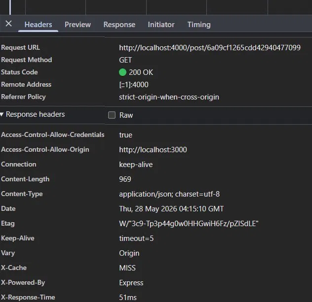
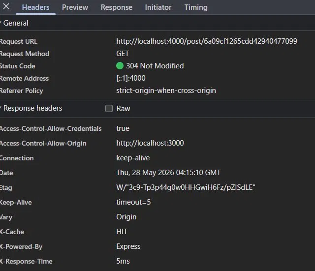

# Full Stack Blog Application

A full-stack blog platform built with React, Tailwind CSS, Express, MongoDB, and Node.js.

## Overview

This project includes:

- A **React frontend** with client-side routing and a rich text editor.
- A **Node/Express backend** with JWT-based authentication and cookie sessions.
- A **MongoDB database** for users, posts, comments, claps, and reposts.
- Support for **cover image uploads** and **nested comment replies**.

## Features

- User registration and login
- Protected routes for creating and editing posts
- Post creation with title, summary, rich text content, and cover image upload
- Post editing for the original author only
- Home feed with latest posts
- Individual post page with:
  - author details
  - cover image
  - clap button (per-user clap tracking)
  - repost toggle
  - comments with reply support and delete own comment

## Tech Stack

- Frontend: React, React Router, Tailwind CSS, React Quill
- Backend: Node.js, Express, Mongoose, JWT, Multer
- Database: MongoDB with Redis caching layer
- Cache: Redis (in-memory data store for high-performance caching)
- Authentication: secure cookies and JSON Web Tokens

## Repository Structure

- `backend/` — Express API server
- `frontend/` — React application
- `backend/uploads/` — uploaded cover images served statically

## Backend Setup

### Install dependencies

```bash
cd backend
npm install
```

### Redis Setup

Make sure Redis is running locally or via Docker:

```bash
# Using Docker
docker run -d -p 6379:6379 redis:latest

# Or install locally and run
redis-server
```

### Environment Variables

Create a `.env` file inside `backend/` with:

```env
PORT=4000
MONGO_URL=your-mongodb-connection-string
JWT_SECRET=your_jwt_secret
CLIENT_URL=http://localhost:3000
REDIS_URL=redis://localhost:6379
```

### Run the backend

```bash
npm run dev
```

or

```bash
npm start
```

### API Endpoints

- `POST /register` — register a new user
- `POST /login` — login and receive a cookie token
- `GET /profile` — fetch current user profile
- `POST /logout` — clear auth cookie
- `GET /post` — fetch latest posts **(Redis cached for 1 hour)**
- `GET /post/:id` — fetch a single post **(Redis cached for 1 hour)**
- `POST /post` — create a post (authenticated, invalidates cache)
- `PUT /post` — update a post (authenticated, author only, invalidates cache)
- `POST /post/:id/clap` — clap a post (authenticated, invalidates cache)
- `POST /post/:id/repost` — repost/undo repost (authenticated)
- `GET /comments/:postId` — fetch comments for a post
- `POST /comments/:postId` — create a comment or reply (authenticated)
- `DELETE /comments/:id` — delete own comment (authenticated)

## Frontend Setup

### Install dependencies

```bash
cd frontend
npm install
```

### Run the frontend

```bash
npm start
```

### App Routes

- `/` — home feed with posts
- `/login` — login page
- `/register` — registration page
- `/create` — create a new post
- `/post/:id` — post detail page
- `/edit/:id` — edit your own post

## Deployment (Vercel + Render)

### 1. MongoDB Atlas

1. Create a free cluster at [MongoDB Atlas](https://www.mongodb.net/atlas).
2. Create a database user and allow network access (`0.0.0.0/0` for cloud hosts).
3. Copy the connection string and set it as `MONGO_URL` on Render:

```env
MONGO_URL=mongodb+srv://<user>:<password>@<cluster>.mongodb.net/Blog?retryWrites=true&w=majority
```

### 2. Redis (optional but recommended)

Use [Upstash](https://upstash.com/) (free tier) or Render Redis. Set `REDIS_URL` on Render (Upstash uses `rediss://...`). The API still runs if Redis is unavailable.

### 3. Backend on Render

| Setting | Value |
|---------|--------|
| Root Directory | `backend` |
| Build Command | `npm install` |
| Start Command | `npm start` |

Environment variables:

| Variable | Example |
|----------|---------|
| `MONGO_URL` | Atlas connection string |
| `JWT_SECRET` | long random string |
| `CLIENT_URL` | `https://your-app.vercel.app` |
| `REDIS_URL` | Upstash or Render Redis URL |

Render sets `PORT` and `NODE_ENV=production` automatically. Do not set `PORT` manually.

After deploy, open `https://<your-service>.onrender.com/health` — you should see `{"status":"ok"}`.

### 4. Frontend on Vercel

| Setting | Value |
|---------|--------|
| Root Directory | `frontend` |
| Framework Preset | Create React App |
| Build Command | `npm run build` |
| Output Directory | `build` |

Environment variable:

| Variable | Value |
|----------|--------|
| `REACT_APP_API_URL` | `https://<your-service>.onrender.com` (no trailing slash) |

Redeploy after changing env vars (CRA bakes them in at build time).

### 5. Order of setup

1. Deploy backend on Render first.
2. Set `CLIENT_URL` to your final Vercel URL (add preview URLs comma-separated if needed).
3. Deploy frontend on Vercel with `REACT_APP_API_URL` pointing at Render.

### Cover images on Render

Render uses an **ephemeral filesystem** — uploaded images in `backend/uploads/` are lost when the service restarts. For production, use object storage (Cloudinary, S3, etc.). For demos, uploads work until the next redeploy/restart.

## Notes

- Locally, the frontend uses `REACT_APP_API_URL` or defaults to `http://localhost:4000`.
- Authenticated requests send cookies using `credentials: "include"`.
- Uploaded images are served from `backend/uploads`.
- The backend verifies JWT tokens from cookies on protected routes.

## SEO & Performance

- `frontend/public/index.html` includes a `meta description` for search and sharing.
- The HTML includes `viewport` and `theme-color` meta tags for mobile-friendly rendering.
- Cover images are loaded from the API URL configured via `REACT_APP_API_URL`.
- The app uses semantic structure with `<main>`, `<header>`, and accessible navigation.
- The site includes a favicon and PWA manifest references to improve browser metadata.

## Development Tips

- Start backend first so the frontend can connect to the API.
- Make sure MongoDB is running and `MONGO_URL` is valid.
- Make sure Redis is running on `localhost:6379` (or update `REDIS_URL` in `.env`).
- Use `npm run dev` in backend for auto-reload with `nodemon`.

## Caching Architecture & Performance

### How Redis Caching Works

This application implements a **3-layer caching strategy** for optimal performance:

#### Layer 1: Browser Cache (ETag)
- Static assets (images, fonts) are cached for 7 days with ETag validation
- Subsequent requests return `304 Not Modified` when content hasn't changed
- No data transfer, instant response

#### Layer 2: Redis Cache (Application-level)
- Posts feed (`/post`) — cached for 1 hour under key `posts:all`
- Individual posts (`/post/:id`) — cached for 1 hour under key `post:{id}`
- Cache automatically invalidates when:
  - A new post is created
  - A post is updated
  - A post receives a clap
  - A post is reposted
- Response headers include `X-Cache: HIT|MISS` and `X-Response-Time` for debugging

#### Layer 3: Database Query (MongoDB)
- Only executed on cache miss
- Expensive operation: populates related documents (author, comments, reposts)

### Real Performance Results ✅

**Testing with a single user accessing the same post:**

| Request | Cache Status | Response Time | Source | Headers |
|---------|--------------|---------------|--------|---------|
| 1st Request | MISS | **51ms** | MongoDB | `X-Cache: MISS` |
| 2nd Request | HIT | **5ms** | Redis RAM | `X-Cache: HIT`, `304 Not Modified` |

**Performance Improvement: 10x faster** ⚡

#### Cache MISS (First Request - MongoDB)


#### Cache HIT (Second Request - Redis)


### Interview Talking Points

> "I can prove it live. On the first request you can see `X-Cache: MISS` and `X-Response-Time: 51ms` — that's MongoDB being queried. On the second request you see `X-Cache: HIT` and `X-Response-Time: 5ms` — that's Redis serving from RAM. That's a 10x improvement on a single user. 
>
> At scale with hundreds of concurrent users hitting the same post, the difference becomes even more dramatic because MongoDB never gets touched after that first request. The browser also caches with ETags, so you actually have two caching layers working together:
> - **Browser cache** → `304 Not Modified`, no data transferred
> - **Redis cache** → `5ms` response from RAM  
> - **MongoDB** → only on first miss (`51ms`)"

### Cache Invalidation Strategy

Smart cache invalidation ensures data consistency while maximizing cache hits:

```
CREATE POST      → Invalidates: posts:all
UPDATE POST :id  → Invalidates: post:id, posts:all
CLAP POST :id    → Invalidates: post:id, posts:all
REPOST :id       → Invalidates: post:id, posts:all
DELETE COMMENT   → No cache impact (comments cached separately)
```

This ensures users always see accurate data while benefiting from caching on most requests.
